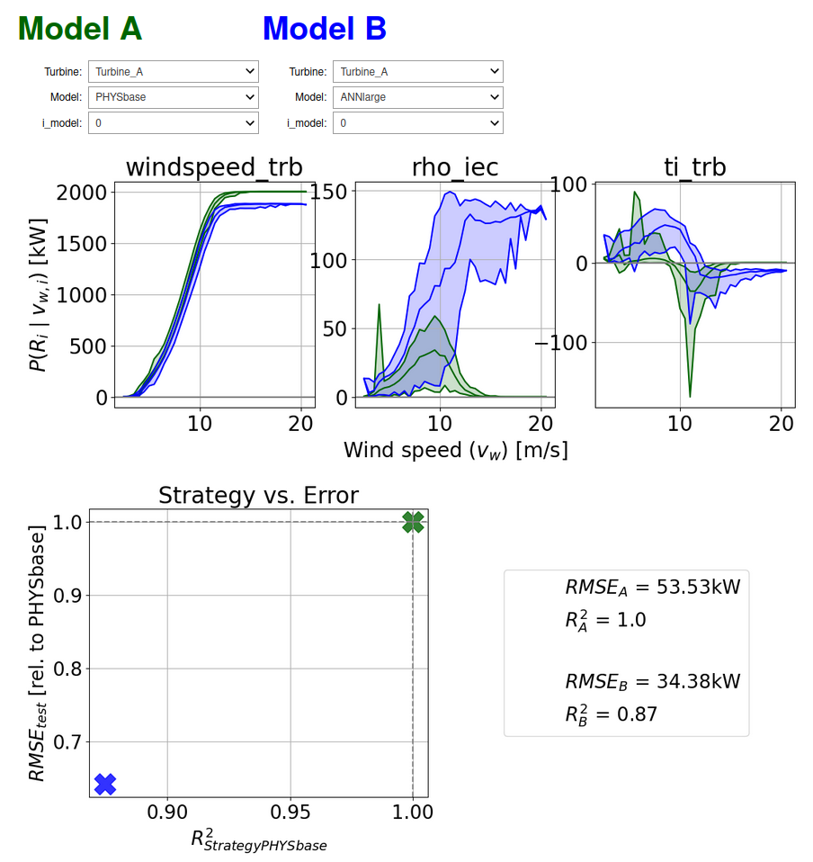

# XAI4WindPowerCurves


## About
Welcome to XAI4WindPowerCurves. We think of explainable artificial intelligence (XAI) as crucial for an informed application of machine learning methods in practice. Here, we publish an implementations of the methods presented in our paper "An XAI framework for robust and transparent data-driven wind turbine power curve models", which was published in [Energy & AI](https://www.sciencedirect.com/science/article/pii/S2666546823001003). Star us for automated updates on the matter.

## Documentation on how to use code and models:

### Preliminaries:
```
trb_key in {'Turbine_A', 'Turbine_B', 'Turbine_C', 'Turbine_D'}
method_key in {'ANNlarge', 'ANNsmall', 'PHYSbase', 'PLR', 'PPR', 'RF', 'SVR'}
data_set_key in {'train', 'val', 'test'}
feature in {'windspeed_trb', 'rho_iec', 'ti_trb'}
```

### Data (dct_data):
For this study, we have utilized the data from the EDP open data platform (https://www.edp.com/en/innovation/open-data/data). Since we do not have the permission to re-distribute the dataset ourselves, this repository contains only pointers to the respective data. You can download the data yourself and adjust the respective 'data_path' variables of the 'load_scada_data' and 'load_metmast_data' functions. The 'dct_data'-dictionary in this repository holds only the time-stamps (pd.DatetimeIndexes) of the data-points used for training, validation and test of the four turbines (dct_data[trb_key][data_set_key]). With the help of the 'fill_dct_data'-function, the respective datapoints can be imported into the given structure. Note, that we perform a min/max scaling for each of the three input features - the parameters for the scaling are held in the dct_data[trb_id]['scaler']. This will also allow you to use the published models on any data set of yours, e.g. as a pre-trained model or baseline for transfer learning. 

As for the models, the input features are: 'windspeed' feature corresponds to the turbine's 'Amb_WindSpeed_Std' parameter, the 'rho_iec' parameter calculated from metmast data (see utils.py) and the 'rho_iec' feature as as the turbine's 'Amb_WindSpeed_Std' diveded by its 'Amb_WindSpeed_Std' recordings. The model target are the turbine 'Grd_Prod_Pwr_Avg' recordings.

### Models (dct_models):
The models trained within this work are stored in a pickled dictionary called dct_models, which can be obtained from [here](https://zenodo.org/records/15119924). Each key has the form '{trb_key}_{method_key}'  and holds a list of models. Lists for deterministic models (PHYSbase, PLR, PPR, and SVR) have only one entry, all others (ANNs and RF) contain 10 models, each trained with identical settings but a different random initialization. The model classes for PHYSbase, PLR and PPR are defined within utils.py. The ANNs, SVRs and RFs are standard sklearn models with their respective attributes.

### Model Attributes (df_rmse, df_exp, df_corr_exp):
Each model holds the attributes 'df_rmse', 'df_exp' and 'df_corr_exp'. The first contains RMSE values for the model's train, val and test set. The second holds a pandas Dataframe with Shapley Values for each feature on data points from the validation set. These were utilized to calculate the alignment (correlation) of the IEC-based 'PHYSbase' models and the data-driven methods (our proposed validation metric to complement RMSEs). 'df_corr_exp' holds these correlation values between the data-driven model and PHYSbase-model's attributions. The  `explain_model()` function of the utils.py can be used to calculate further explanations (on other data points, for example). 

### !!! Corrections !!!
When publishing this code-base following journal publication we have noticed a small mistake in the TI-correction of the PHYSbase-models. All reported observations remain valid, but small changes of the numerical results will be encounted when re-calculated. The old, depreciated `PHYS_base` class was still added for transparency reasons.

## Jupyter notebook (XAI4WIND_demo.ipynb)
The [XAI4WIND_demo](XAI4WIND_demo.ipynb) notebook allows for a convenient data and model import, model predictions, the calculation of model attributions and an interactive side-to-side comparison of the published models' strategies:


## If you use this code please star the repository and cite the following paper:

[S. Letzgus and K.-R. Müller, “An explainable ai framework for robust and transparent data-driven wind turbine power curve models”, Energy and AI, vol. 15, Art. no. 100328, 2024.](https://www.sciencedirect.com/science/article/pii/S2666546823001003)
  ```
@article{Letzgus_XAI4WPC_2024,
title = {An explainable AI framework for robust and transparent data-driven wind turbine power curve models},
journal = {Energy and AI},
volume = {15},
pages = {100328},
year = {2024},
issn = {2666-5468},
doi = {https://doi.org/10.1016/j.egyai.2023.100328},
url = {https://www.sciencedirect.com/science/article/pii/S2666546823001003},
author = {Simon Letzgus and Klaus-Robert Müller}
}
  ```
## Contact:

In case you have questions or feedback regarding the publication or the code, feel free to contact simon.leszek[at]tu-berlin.de