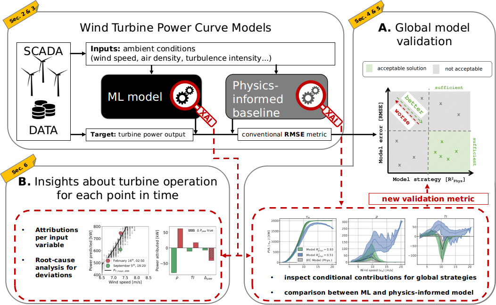

# XAI4WindPowerCurves


## About
Welcome to XAI4WindPowerCurves. We think of explainable artificial intelligence (XAI) as crucial for an informed application of machine learning methods in practice. Here, we soon present implementations of the methods presented in our paper "An XAI framework for robust and transparent data-driven wind turbine power curve models", which currently is under review. Star us for automated updates on the matter.

## If you use this code please star the repository and cite the following paper:

[S. Letzgus and K.-R. Müller, “An explainable ai framework for robust and transparent data-driven wind turbine power curve models”, Energy and AI, vol. 15, Art. no. 100328, 2024.](https://www.sciencedirect.com/science/article/pii/S2666546823001003)
  ```
@article{Letzgus_XAI4WPC_2024,
title = {An explainable AI framework for robust and transparent data-driven wind turbine power curve models},
journal = {Energy and AI},
volume = {15},
pages = {100328},
year = {2024},
issn = {2666-5468},
doi = {https://doi.org/10.1016/j.egyai.2023.100328},
url = {https://www.sciencedirect.com/science/article/pii/S2666546823001003},
author = {Simon Letzgus and Klaus-Robert Müller}
}
  ```
